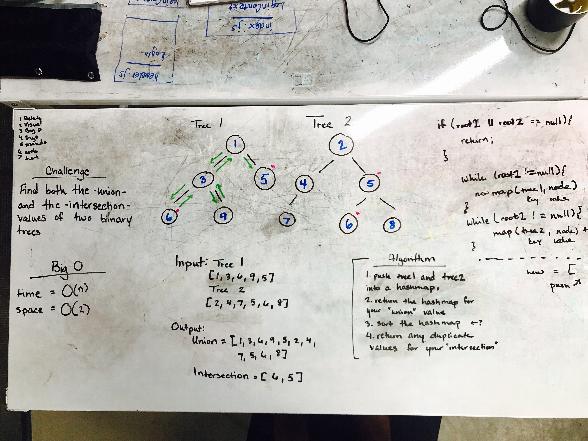

# Challenge Summary
 Find the Union and Intersection of two Binary Trees

## Challenge Description
Given two binary trees, find both the union and the intersection recursively.

## Approach & Efficiency
I pushed the values of each tree into a Hashmap, and from there printed any duplicates. This approach assumes that there were originally no duplicate values in either original tree. 

O(N) Time
O(N) Space

## Solution

